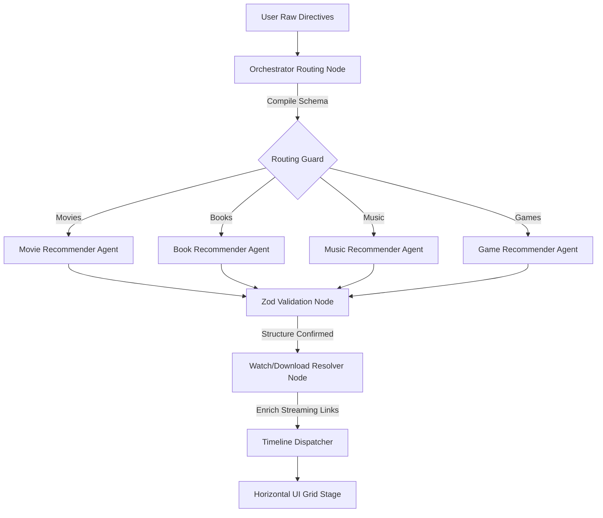

# OmniMind AI — Next-Gen Multi-Agent Graph Recommender Hub

OmniMind AI is a next-generation cognitive recommender orchestrator built on a **multi-agent graph routing architecture**. Unlike static recommendation systems or simple prompt-wrapping scripts, OmniMind models discovery as a structured state machine using **LangGraph** and **Gemini 2.5 Flash**, orchestrating dedicated agent nodes for different domains (Movies, Books, Music, Games) with real-time validation and streaming timeline events.

---

## 🚀 Advanced Cognitive Architecture

OmniMind models recommendation queries as a stateful, directed acyclic graph (DAG) where nodes represent specialized cognitive functions:



### 🧠 Core Architectural Flow
1. **Orchestrator Routing Node:** Parses raw user inputs, active category settings, genres, and moods. It compiles these variables into structured state parameters.
2. **Specialized Recommender Agents:** Invokes domain-specific graph nodes powered by Gemini 2.5 Flash. Each agent executes domain-specific prompts and searches internal indexes.
3. **Strict Zod Schema Validation Node:** Enforces Type Declarations (Zod Schemas) on JSON payloads before shipping to the client. This guarantees shape validation for cast lists, platform array strings, ratings, and structural descriptions.
4. **Watch/Download Resolver Node:** Dynamically parses recommendations and queries public repositories (JustWatch, YouTube, Project Gutenberg, Steam, itch.io) to inject real-time watch, stream, download, or purchase links.
5. **Timeline Dispatcher:** Streams step-by-step state logs back to the client, providing real-time feedback of the agent's cognitive workflow (e.g. `Resolving streaming sources`, `Structuring types`).

---

## 🎨 Premium Front-End Design Systems

The frontend is styled in a **Dribbble/Pinterest-inspired horizontal layout**, emphasizing minimalism, smooth transitions, and dynamic visual states:

* **Sticky Frosted Glass Navbar:** Sits absolutely transparent over the cosmos sky background on load. As users scroll down, it triggers scroll event listeners to transition into a frosted glass container (`backdrop-filter: blur(16px)`) with dynamic theme colors (warm Alabaster in light mode, deep Obsidian glass in dark mode).
* **Horizontal Control Shelf:** Consolidates prompts, ranges, genres, and mood selectors into a horizontal bar, removing vertical sidebars to focus on grid presentation.
* **Obsidian-Clay Default Palette:** Boots in a dark slate layout (`#0d0d0c` canvas background, `#141413` card containers) with a warm terracotta clay orange accent (`#d96b43`).
* **Glassmorphic Slide-Over Drawers:** Favorites and Recent History slide in dynamically from the right over a frosted backdrop filter overlay.

---

## 📂 Project Structure

```
langchain/
├── backend/                  # LangChain / Express Recommender API
│   ├── src/
│   │   ├── controllers/      # Route controllers for Movie, Book, Game, Music
│   │   ├── models/           # Zod schema definitions and types
│   │   ├── routes/           # Express routing layers
│   │   └── services/         # LangChain & Gemini integration services
│   └── package.json
└── frontend/                 # React 18 / Vite Workspace
    ├── src/
    │   ├── components/       # Drawer panels, Detail modals, Card stages
    │   ├── pages/            # Nexa-style Landing page & Dashboard view
    │   ├── types/            # TypeScript model interfaces
    │   └── utils/            # Client cache managers & mock data engines
    └── package.json
```

---

## 🛠️ Local Development Installation

Follow these steps to run the multi-agent recommender on your local environment:

### Prerequisites
* Node.js (v18+)
* Gemini API Key

### 1. Run the Backend Server
Navigate to the `backend` directory, create a `.env` file, and install dependencies:
```bash
cd backend
npm install
```
Create a `.env` file inside `backend/` and configure:
```env
PORT=8000
GEMINI_API_KEY=your_gemini_api_key_here
```
Launch the development server:
```bash
npm run dev
```
The server will run on `http://localhost:8000`.

### 2. Run the Frontend App
Navigate to the `frontend` directory and install dependencies:
```bash
cd ../frontend
npm install
```
Launch the client application:
```bash
npm run dev
```
The application will run on `http://localhost:5173`. Open this URL in your browser to view the Nexa-style landing page.
